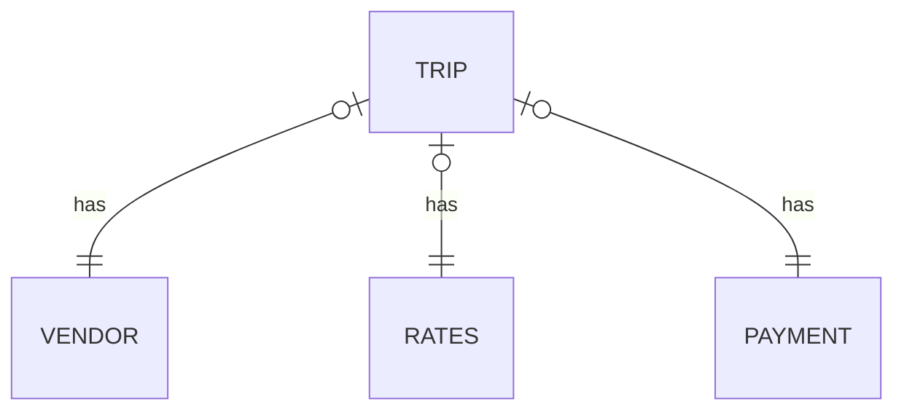

## Данные

Мы будем использовать данные о поездках такси (подробнее см. [описание](../practice1/README.md) 

Схема данных:

## собрать витрину сгруппированную по неделям:

1. номер недели
2. тип оплаты
3. средний чек
4. отношение чаевых к стоимости поездки
5. (опционально) выгрузить результат в Greenplum
