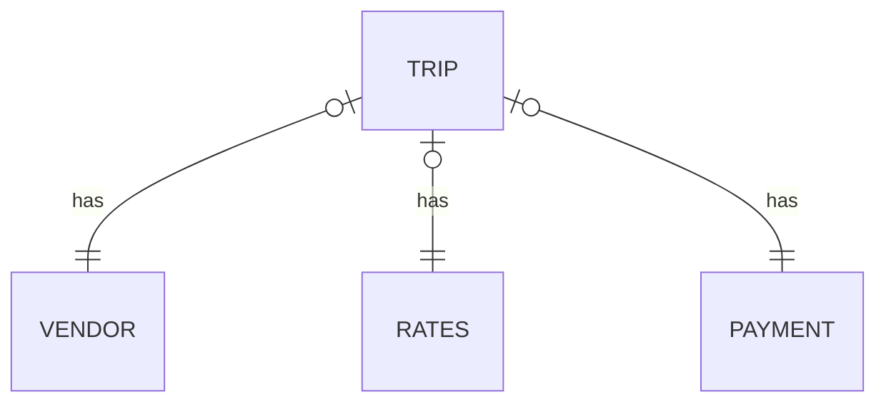

## Задача 
собрать витрину следующего вида:

| Номер недели | Тип оплаты | Средний чек | Отношение чаевых к стоимости поездки |
| :------------| :--- | :------------------ | :--------------- |
|14| Credit card |	10.55| 0.11332316152772907 |

результаты опубликовывать через каждые 10 секунд с помощью брокера сообщений Kafka

## Данные

Используем данные о поездках такси (подробнее см. [описание](https://www1.nyc.gov/assets/tlc/downloads/pdf/data_dictionary_trip_records_yellow.pdf))

Схема данных:

данные опубликовываются брокером сообщений Kafka
